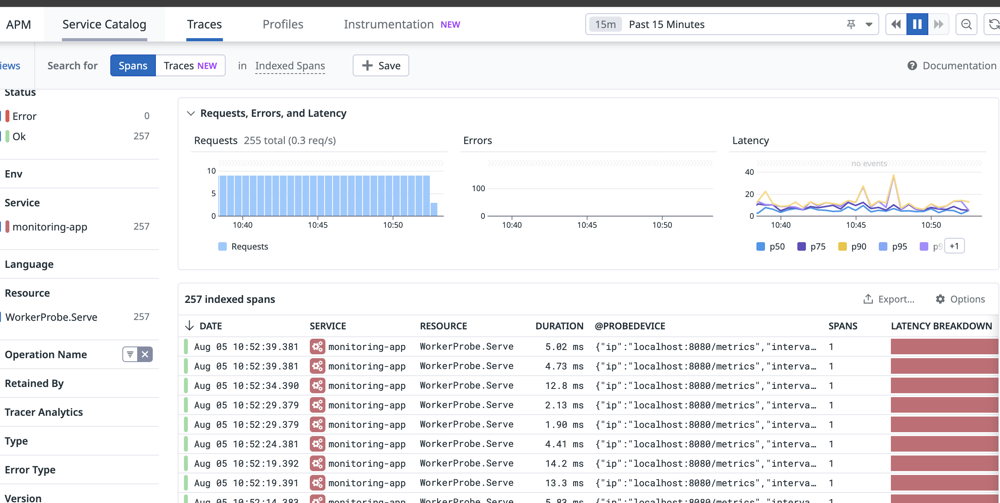

# Monitoring App

This service probes devices using the http module. You can configure the devices to probe by adding entries to the `probe_config.yaml` file.

## Features

- **Performance Monitoring**: Continuously monitors device performance using the http module.
- **Error Tracking and Diagnostics**: Automatically detects and logs errors encountered during probing.
- **Real-Time Alerts**: Integrates with Datadog to provide real-time alerts on performance issues.
- **Code-Level Diagnostics**: Uses Datadog APM for tracing probe executions and diagnosing latency issues.

## APM Integration

The APM integration in this service leverages Datadog to provide synthetic monitoring. By wrapping the execution of the http module with Datadog traces, we can monitor the latency and performance of each probe.

### Benefits

1. **End-to-End Monitoring**: The integration allows for detailed end-to-end monitoring of probe execution, from initiation to completion.
2. **Latency Tracking**: Datadog traces provide insights into the latency of each probe, helping identify slow or unresponsive devices.
3. **Error Analysis**: Detailed trace logs assist in diagnosing errors and understanding where failures occur in the probing process.

### How It Works

- **Initialization**: The APM service is initialized using settings from `config.yaml`. If APM is enabled, it connects to Datadog and sets up tracing.
- **Probing with Traces**: Each probe execution is wrapped in a Datadog trace. This captures the start and end times, any errors, and additional metadata such as the IP address and interval of the probe. This well-organized and searchable in Datadog, making it easier to filter and analyze probe executions by IP address.
- **Synthetic Monitoring**: By capturing these traces, Datadog can perform synthetic monitoring, simulating user interactions and measuring performance metrics over time.


## Prerequisites

- Go 1.18+
- Git


## Installation

1. Clone the repository:

    ```sh
    git clone <repository_url>
    cd monitoring-app
    ```

2. Install the dependencies:

    ```sh
    go mod tidy
    ```

## Configuration

1. **Main Configuration**: `config.yaml`
2. **Probe Configuration**: `probe_config.yaml`

### `config.yaml`

This file contains the main configuration for the service, including logging levels and APM (Application Performance Monitoring) settings.

### `probe_config.yaml`

This file defines the probes to be used by the service. An example structure for a probe is:

```yaml
probes:
  - ip: "192.168.1.1"
    interval: 5
    probeConfig:
      method: "GET"
      headers:
        "User-Agent": "Mozilla/5.0"
      authorization:
        username: "admin"
        password: "admin123"
```

## Running the Service

1. Build the application:

    ```sh
    go build -o monitoring-app
    ```

2. Run the application:

    ```sh
    ./monitoring-app
    ```

## Logging

Logs are managed using the `logger` package. The log level and format can be configured in the `config.yaml` file.

## APM Integration

The service includes Application Performance Monitoring (APM) integration using a wrapper for Datadog APM. This can be configured in the `config.yaml` file and initialized at runtime.

## Code Structure

### `main.go`

The main entry point of the application. It performs the following functions:

- Initializes the configuration and logging.
- Loads the probe configuration from `probe_config.yaml`.
- Initializes the APM if enabled.
- Starts the probes defined in the configuration.
- Handles graceful shutdown on receiving interrupt signals.

## Example `probe_config.yaml`

```yaml
probes:
  - ip: "192.168.1.1"
    interval: 5
    probeConfig:
      method: "GET"
      headers:
        "User-Agent": "Mozilla/5.0"
      authorization:
        username: "admin"
        password: "admin123"
  - ip: "192.168.1.2"
    interval: 10
    probeConfig:
      method: "POST"
      headers:
        "Content-Type": "application/json"
      authorization:
        username: "user"
        password: "user123"
```

This configuration file defines two probes: one probing every 5 seconds and the other every 10 seconds, with different HTTP methods and headers.

## Example result Datadog Trace



