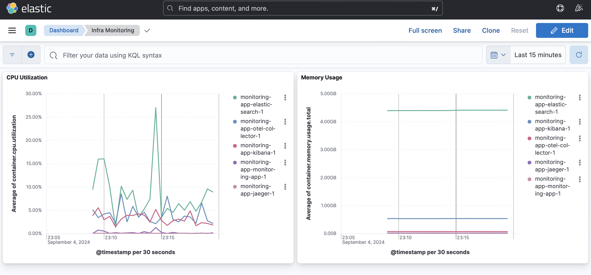
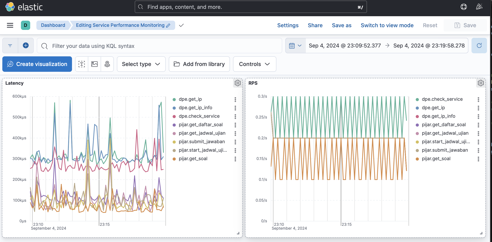
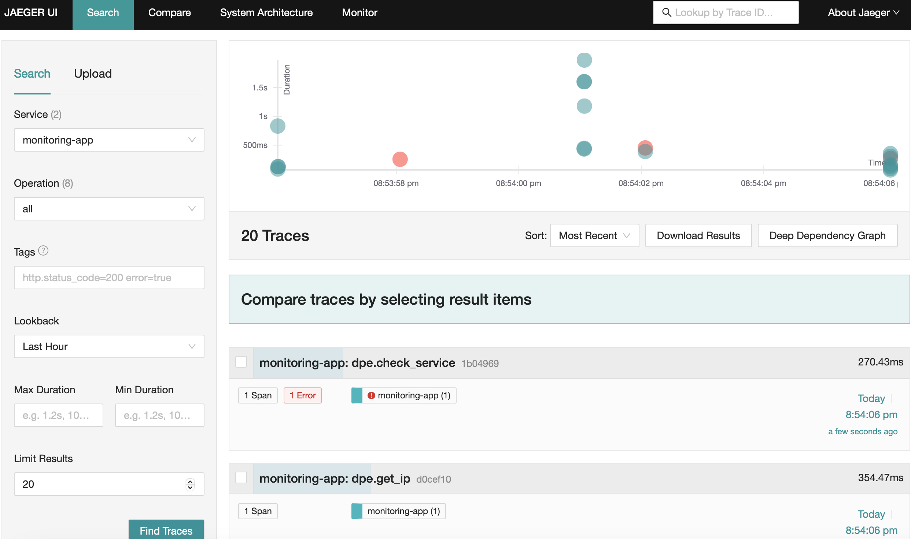
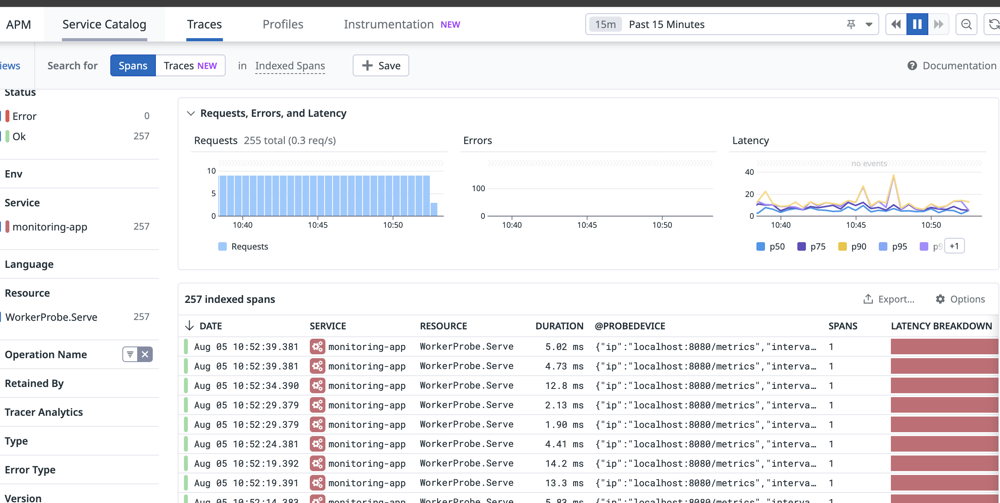

# Monitoring App

This service monitors APIs using the HTTP module. You can configure the APIs to be monitored by adding entries to the `probe_config.yaml` file.

## Features

- **Performance Monitoring**: Continuously monitors API performance using the HTTP module.
- **Error Tracking and Diagnostics**: Automatically detects and logs errors encountered during probing.
- **Real-Time Alerts**: Integrates with the OpenTelemetry Collector to provide real-time alerts on performance issues.
- **Code-Level Diagnostics**: Uses OpenTelemetry for tracing probe executions and diagnosing latency issues.
- **Dependency Handling**: Supports making requests that depend on the results of previous probes.


## APM Integration

The APM integration in this service leverages the OpenTelemetry (OTel) Collector to provide synthetic monitoring. By wrapping the execution of the HTTP module with OpenTelemetry traces, we can monitor the latency and performance of each probe.


### Benefits

1. **End-to-End Monitoring**: The integration allows for detailed end-to-end monitoring of probe execution, from initiation to completion.
2. **Latency Tracking**: OpenTelemetry traces provide insights into the latency of each probe, helping identify slow or unresponsive APIs.
3. **Error Analysis**: Detailed trace logs assist in diagnosing errors and understanding where failures occur in the probing process.

### How It Works

- **Initialization**: The APM service is initialized using settings from `config.yaml`. If APM is enabled, it connects to the OpenTelemetry Collector and sets up tracing.
- **Probing with Traces**: Each probe execution is wrapped in an OpenTelemetry trace. This captures the start and end times, any errors, and additional metadata such as the IP address and interval of the probe. This is well-organized and searchable in the OpenTelemetry backend, making it easier to filter and analyze probe executions by IP address.
- **Synthetic Monitoring**: By capturing these traces, the OpenTelemetry Collector can perform synthetic monitoring, simulating user interactions and measuring performance metrics over time.

### OpenTelemetry Collector Configuration

The OpenTelemetry Collector is configured to receive data from various sources, process it, and export it to different backends. Here is a brief explanation of the configuration:

- **Receivers**: The Collector receives data via OTLP (gRPC and HTTP), file logs, and Docker stats.
- **Processors**: The data is processed in batches to optimize performance.
- **Exporters**: The processed data is exported to Elasticsearch for traces, metrics, and logs, as well as to Jaeger and Datadog for traces.
- **Service Pipelines**: Separate pipelines are defined for metrics, traces, and logs, specifying the receivers, processors, and exporters for each type of data.


## Prerequisites

- Go 1.18+
- Git


## Installation

1. Clone the repository:

    ```sh
    git clone <repository_url>
    cd monitoring-app
    ```

2. Install the dependencies:

    ```sh
    go mod tidy
    ```

## Configuration

1. **Main Configuration**: `config.yaml`
2. **Probe Configuration**: `probe_config.yaml`

### `config.yaml`

This file contains the main configuration for the service, including logging levels and APM (Application Performance Monitoring) settings.

### `probe_config.yaml`

This file defines the probes to be used by the service, supporting dependencies between probes. Each probe can use the results from other probes in its configuration. An example structure for a probe is:

```yaml
probes:
  - operation: "get_ip"
    tribe: "dpe"
    ip: "https://api.ipify.org"
    interval: 5
    probe_config:
      method: "GET"
      authorization: null
      query:
        format: "json"
      headers:
        Content-Type: application/json
  - operation: "get_ip_info"
    tribe: "dpe"
    ip: "https://api.ipify.org"
    interval: 5
    probe_config:
      method: "GET"
      authorization: null
      query:
        format: "json"
      headers:
        Content-Type: application/json
  - operation: "check_service"
    tribe: "dpe"
    ip: "https://example.com/check"
    dependencies: ["get_ip", "get_ip_info"]
    interval: 4
    probe_config:
      method: "POST"
      authorization: null
      query:
        formatee: "{{get_ip_info.ip}}"
        coba: "lainnya"
      headers:
        Content-Type: application/json
        Authorization: "Bearer {{get_ip_info.ip}}"
      body: |
        {
          "ip": "{{get_ip.ip}}",
          "city": "{{get_ip_info.ip}}"
        }

```

### Explanation
This configuration file defines three probes, where the last probe (check_service) depends on the results of the first two probes (get_ip and get_ip_info).

- **operation**: A unique identifier for each probe. This name is used to refer to the probe in dependencies.
- **tribe**: A grouping label for the probe, useful for organizing and filtering.
- **ip**: The target URL of the probe.
- **dependencies**: A list of other operations that this probe depends on. The probe can use the results of these dependencies in its configuration.
- **interval**: The time interval (in seconds) between each probe execution.
- **probe_config**: The specific configuration for the HTTP request, including method, headers, query parameters, and body. Placeholders (e.g., `{{get_ip.ip}}`) can be used to insert the results of dependencies.

## Running the Service

1. Build the application:

    ```sh
    go build -o monitoring-app
    ```

2. Run the application:

    ```sh
    ./monitoring-app
    ```

## Kibana and Elasticsearch Integration

This service also integrates with Elasticsearch and Kibana for logging and visualization. Logs are sent to Elasticsearch, and you can use Kibana to visualize and analyze these logs.

### Importing Kibana Dashboard

To import the provided Kibana dashboard, follow these steps:

1. Open Kibana in your web browser.
2. Go to **Management** > **Stack Management** > **Saved Objects**.
3. Click on the **Import** button.
4. Select the `kibana-dashboard/dashboard.ndjson` file from the repository.
5. Click **Import** to load the dashboard into Kibana.

This dashboard provides visualizations and insights into the logs generated by the monitoring service.

## Logging

Logs are managed using the `logger` package. The log level and format can be configured in the `config.yaml` file.

## APM Integration

The service includes Application Performance Monitoring (APM) integration using a wrapper for Datadog APM. This can be configured in the `config.yaml` file and initialized at runtime.

## Code Structure

### `main.go`

The main entry point of the application. It performs the following functions:

- Initializes the configuration and logging.
- Loads the probe configuration from `probe_config.yaml`.
- Initializes the APM if enabled.
- Starts the probes defined in the configuration.
- Handles graceful shutdown on receiving interrupt signals.


## Example result Kibana (Infra-monitoring Dashboard)



## Example result Kibana (Service-performance-monitoring Dashboard)



## Example result Jaeger Trace



## Example result Datadog Trace



